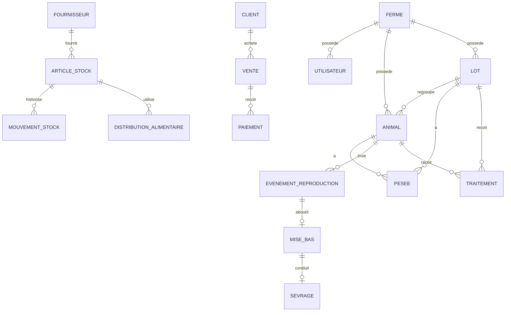

# Modele de donnees - Application de gestion de porcherie

## 1. Objectif du document

Ce document definit les donnees a stocker dans l'application, les relations entre elles et les regles de base. Il servira de reference pour construire la base de donnees, les formulaires, les rapports et le futur prototype fonctionnel.

Le modele est pense pour une application moderne mais simple, adaptee aux fermiers. Il permet une gestion par animal, par lot, ou mixte.

## 2. Principes generaux

### 2.1 Gestion par ferme

Toutes les donnees importantes doivent etre rattachees a une ferme. Cela permettra plus tard de gerer plusieurs fermes avec un meme compte.

### 2.2 Gestion par animal et par lot

L'application doit accepter deux modes :

- Gestion individuelle : utile pour les truies, verrats et reproducteurs importants.
- Gestion par lot : utile pour porcelets, engraissement et petites fermes qui ne marquent pas chaque animal.

Certains evenements peuvent donc concerner soit un animal, soit un lot.

### 2.3 Historique complet

Au lieu d'ecraser les informations importantes, l'application doit conserver un historique : traitements, pesees, ventes, mouvements de stock, evenements de reproduction, mortalites.

### 2.4 Donnees hors ligne

Chaque table doit pouvoir fonctionner en mode hors ligne. Il est donc recommande d'avoir :

- un identifiant unique local ;
- une date de creation ;
- une date de modification ;
- un statut de synchronisation dans une version avancee.

## 3. Tables principales

## 3.1 Ferme

### Role

Representer une porcherie ou une exploitation.

### Champs

- id
- nom
- pays
- ville
- adresse
- devise
- telephone
- email
- nom_proprietaire
- taille_estimee_cheptel
- mode_gestion : animal, lot, mixte
- date_creation
- date_modification

### Relations

- Une ferme possede plusieurs utilisateurs
- Une ferme possede plusieurs animaux
- Une ferme possede plusieurs lots
- Une ferme possede des stocks, ventes, depenses et rapports

## 3.2 Utilisateur

### Role

Representer une personne qui utilise l'application.

### Champs

- id
- ferme_id
- nom
- telephone
- email
- mot_de_passe_hash
- role : proprietaire, gerant, employe, veterinaire, comptable
- actif : oui/non
- derniere_connexion
- date_creation
- date_modification

### Relations

- Un utilisateur appartient a une ferme
- Un utilisateur peut creer des taches, ventes, traitements et mouvements de stock

## 3.3 Animal

### Role

Representer un porc suivi individuellement.

### Champs

- id
- ferme_id
- identifiant
- nom
- categorie : truie, verrat, porcelet, engraissement, reforme
- sexe : male, femelle, inconnu
- race
- date_naissance
- date_entree
- origine : ne_a_la_ferme, achat, don, transfert, autre
- poids_actuel
- statut : actif, vendu, mort, reforme
- emplacement_id
- mere_id
- pere_id
- lot_id
- observations
- date_creation
- date_modification

### Relations

- Un animal appartient a une ferme
- Un animal peut appartenir a un lot
- Un animal peut avoir une mere et un pere
- Un animal peut avoir plusieurs pesees
- Un animal peut avoir plusieurs traitements
- Une truie peut avoir plusieurs evenements de reproduction
- Un animal peut etre vendu ou declare mort

## 3.4 Lot

### Role

Representer un groupe d'animaux gere ensemble.

### Champs

- id
- ferme_id
- nom
- categorie : porcelets, engraissement, reproducteurs, autre
- nombre_initial
- nombre_actuel
- date_creation_lot
- date_entree
- poids_moyen
- origine : naissance, achat, transfert, autre
- statut : actif, vendu, termine
- emplacement_id
- observations
- date_creation
- date_modification

### Relations

- Un lot appartient a une ferme
- Un lot peut contenir plusieurs animaux individuels
- Un lot peut recevoir des traitements
- Un lot peut recevoir des distributions alimentaires
- Un lot peut etre vendu partiellement ou totalement
- Un lot peut subir des pertes ou mortalites

## 3.5 Emplacement

### Role

Representer les batiments, loges, parcs ou enclos.

### Champs

- id
- ferme_id
- nom
- type : batiment, loge, parc, enclos, quarantaine, autre
- capacite
- statut : disponible, occupe, maintenance
- observations
- date_creation
- date_modification

### Relations

- Un emplacement peut contenir plusieurs animaux ou lots

## 4. Reproduction

## 4.1 EvenementReproduction

### Role

Suivre les saillies, inseminations et gestations.

### Champs

- id
- ferme_id
- truie_id
- verrat_id
- type : saillie_naturelle, insemination
- date_evenement
- date_retour_chaleur_prevue
- date_diagnostic_gestation_prevue
- date_mise_bas_prevue
- statut : en_attente, gestation_confirmee, echec, mise_bas_effectuee
- observations
- cree_par_id
- date_creation
- date_modification

### Relations

- Lie une truie a un verrat ou a une insemination
- Peut aboutir a une mise bas

## 4.2 MiseBas

### Role

Enregistrer le resultat d'une mise bas.

### Champs

- id
- ferme_id
- evenement_reproduction_id
- truie_id
- date_mise_bas
- nes_vivants
- mort_nes
- morts_apres_naissance
- nombre_total
- lot_porcelets_id
- observations
- cree_par_id
- date_creation
- date_modification

### Relations

- Une mise bas appartient a une truie
- Une mise bas peut creer un lot de porcelets
- Une mise bas alimente les indicateurs de reproduction

## 4.3 Sevrage

### Role

Suivre le passage des porcelets apres allaitement.

### Champs

- id
- ferme_id
- mise_bas_id
- truie_id
- lot_id
- date_sevrage
- nombre_sevre
- poids_moyen
- destination : nouveau_lot, vente, autre
- observations
- cree_par_id
- date_creation
- date_modification

### Relations

- Un sevrage est lie a une mise bas ou a un lot

## 5. Sante animale

## 5.1 ProblemeSanitaire

### Role

Enregistrer une maladie, un symptome ou une observation sanitaire.

### Champs

- id
- ferme_id
- animal_id
- lot_id
- date_signalement
- symptomes
- gravite : faible, moyenne, elevee, critique
- statut : ouvert, sous_observation, resolu, mort
- signale_par_id
- observations
- date_creation
- date_modification

### Relations

- Peut concerner un animal ou un lot
- Peut avoir plusieurs traitements

## 5.2 Traitement

### Role

Enregistrer les medicaments ou soins administres.

### Champs

- id
- ferme_id
- probleme_sanitaire_id
- animal_id
- lot_id
- article_stock_id
- medicament_nom
- dose
- unite_dose
- date_debut
- date_fin
- responsable_id
- veterinaire_nom
- periode_retrait_jours
- date_fin_retrait
- observations
- date_creation
- date_modification

### Relations

- Peut diminuer le stock de medicament
- Peut creer une alerte de renouvellement ou de retrait avant vente

## 5.3 Vaccination

### Role

Suivre les vaccins effectues et a venir.

### Champs

- id
- ferme_id
- animal_id
- lot_id
- vaccin_nom
- article_stock_id
- date_vaccination
- prochaine_date
- responsable_id
- observations
- date_creation
- date_modification

## 5.4 Mortalite

### Role

Enregistrer les pertes d'animaux.

### Champs

- id
- ferme_id
- animal_id
- lot_id
- date_mortalite
- nombre
- cause_probable
- observations
- declare_par_id
- date_creation
- date_modification

### Relations

- Modifie le statut d'un animal individuel ou reduit le nombre actuel d'un lot
- Alimente les rapports sanitaires et le taux de mortalite

## 6. Croissance et alimentation

## 6.1 Pesee

### Role

Suivre l'evolution du poids des animaux ou lots.

### Champs

- id
- ferme_id
- animal_id
- lot_id
- date_pesee
- poids
- type_poids : individuel, moyen_lot, total_lot
- responsable_id
- observations
- date_creation
- date_modification

## 6.2 Ration

### Role

Definir une ration alimentaire theorique.

### Champs

- id
- ferme_id
- nom
- categorie_animale
- article_stock_id
- quantite_par_jour
- unite
- frequence
- cout_estime
- actif
- date_creation
- date_modification

## 6.3 DistributionAlimentaire

### Role

Enregistrer les aliments distribues.

### Champs

- id
- ferme_id
- animal_id
- lot_id
- article_stock_id
- date_distribution
- quantite
- unite
- responsable_id
- cout_estime
- observations
- date_creation
- date_modification

### Relations

- Diminue le stock d'aliment
- Alimente le cout alimentaire

## 7. Stocks

## 7.1 ArticleStock

### Role

Representer un produit gere en stock.

### Champs

- id
- ferme_id
- nom
- categorie : aliment, medicament, vaccin, nettoyage, materiel, autre
- unite : kg, sac, litre, dose, boite, piece
- quantite_disponible
- seuil_alerte
- prix_unitaire_moyen
- fournisseur_id
- date_expiration
- actif
- date_creation
- date_modification

## 7.2 MouvementStock

### Role

Historiser les entrees et sorties de stock.

### Champs

- id
- ferme_id
- article_stock_id
- type_mouvement : entree, sortie, ajustement
- motif : achat, alimentation, traitement, vaccination, nettoyage, perte, correction, autre
- quantite
- prix_total
- date_mouvement
- fournisseur_id
- responsable_id
- reference
- observations
- date_creation
- date_modification

### Relations

- Chaque mouvement modifie la quantite disponible d'un article

## 7.3 Fournisseur

### Role

Enregistrer les fournisseurs d'aliments, medicaments et materiel.

### Champs

- id
- ferme_id
- nom
- telephone
- email
- adresse
- type_fournisseur : aliment, medicament, materiel, transport, autre
- observations
- date_creation
- date_modification

## 8. Ventes et finances

## 8.1 Client

### Role

Representer les acheteurs.

### Champs

- id
- ferme_id
- nom
- telephone
- adresse
- type_client : particulier, grossiste, boucherie, restaurant, autre
- solde_du
- observations
- date_creation
- date_modification

## 8.2 Vente

### Role

Enregistrer une vente.

### Champs

- id
- ferme_id
- client_id
- date_vente
- type_vente : animal, lot, viande, autre
- animal_id
- lot_id
- nombre_animaux
- poids_total
- mode_prix : par_animal, par_kg, par_lot
- prix_unitaire
- montant_total
- montant_paye
- reste_a_payer
- mode_paiement : espece, mobile_money, banque, credit, autre
- statut_paiement : paye, partiel, impaye
- cree_par_id
- observations
- date_creation
- date_modification

### Relations

- Peut changer le statut d'un animal en vendu
- Peut reduire le nombre actuel d'un lot
- Alimente le chiffre d'affaires et les creances

## 8.3 Depense

### Role

Enregistrer les sorties d'argent.

### Champs

- id
- ferme_id
- date_depense
- categorie : aliment, medicament, vaccin, main_oeuvre, transport, entretien, eau, energie, achat_animal, autre
- montant
- beneficiaire
- fournisseur_id
- mode_paiement
- description
- cree_par_id
- date_creation
- date_modification

## 8.4 Paiement

### Role

Suivre les paiements partiels ou remboursements.

### Champs

- id
- ferme_id
- vente_id
- client_id
- date_paiement
- montant
- mode_paiement
- recu_par_id
- observations
- date_creation
- date_modification

## 9. Taches et alertes

## 9.1 Tache

### Role

Planifier et suivre les travaux quotidiens.

### Champs

- id
- ferme_id
- titre
- description
- date_prevue
- heure_prevue
- priorite : basse, normale, haute, urgente
- statut : a_faire, en_cours, termine, annule
- responsable_id
- animal_id
- lot_id
- repetition : aucune, quotidienne, hebdomadaire, mensuelle
- date_realisation
- cree_par_id
- date_creation
- date_modification

## 9.2 Alerte

### Role

Afficher les rappels importants.

### Champs

- id
- ferme_id
- type_alerte : reproduction, sante, stock, paiement, tache, autre
- titre
- message
- date_alerte
- priorite : basse, normale, haute, urgente
- statut : ouverte, vue, resolue, ignoree
- animal_id
- lot_id
- vente_id
- article_stock_id
- tache_id
- date_creation
- date_modification

## 10. Rapports et journal

## 10.1 RapportGenere

### Role

Garder une trace des rapports consultes ou exportes.

### Champs

- id
- ferme_id
- type_rapport : cheptel, reproduction, sante, stock, vente, depense, mensuel
- periode_debut
- periode_fin
- format : ecran, pdf, excel
- genere_par_id
- date_generation
- chemin_fichier
- date_creation

## 10.2 JournalAction

### Role

Tracer les actions importantes pour la securite et le controle.

### Champs

- id
- ferme_id
- utilisateur_id
- action
- entite
- entite_id
- details
- date_action

## 11. Relations principales en resume

- Ferme 1 -> plusieurs Utilisateurs
- Ferme 1 -> plusieurs Animaux
- Ferme 1 -> plusieurs Lots
- Lot 1 -> plusieurs Animaux, si suivi mixte
- Animal 1 -> plusieurs Pesees
- Lot 1 -> plusieurs Pesees
- Animal ou Lot 1 -> plusieurs Traitements
- Animal ou Lot 1 -> plusieurs Vaccinations
- Truie 1 -> plusieurs EvenementsReproduction
- EvenementReproduction 1 -> 0 ou 1 MiseBas
- MiseBas 1 -> 0 ou 1 Sevrage
- ArticleStock 1 -> plusieurs MouvementsStock
- Vente 1 -> plusieurs Paiements
- Client 1 -> plusieurs Ventes
- Fournisseur 1 -> plusieurs ArticlesStock et Depenses

## 12. Regles de gestion importantes

### 12.1 Animal vendu

Quand un animal individuel est vendu, son statut devient vendu. Il ne doit plus etre compte dans les animaux actifs.

### 12.2 Lot vendu partiellement

Quand une partie d'un lot est vendue, le nombre actuel du lot diminue. Si le nombre actuel devient zero, le lot peut passer au statut termine ou vendu.

### 12.3 Mortalite

Quand une mortalite est declaree :

- Animal individuel : statut = mort
- Lot : nombre actuel diminue du nombre declare mort

### 12.4 Stock faible

Si quantite_disponible est inferieure ou egale au seuil_alerte, une alerte stock faible doit etre creee ou affichee.

### 12.5 Traitement avec retrait

Si un traitement a une periode de retrait, l'application calcule date_fin_retrait. L'animal ou le lot ne doit pas etre vendu sans avertissement avant cette date.

### 12.6 Mise bas

Une mise bas doit mettre a jour les indicateurs de reproduction. Elle peut creer automatiquement un lot de porcelets.

### 12.7 Sevrage

Un sevrage doit enregistrer le nombre de porcelets sevres et peut creer un nouveau lot d'engraissement.

### 12.8 Vente a credit

Si montant_paye est inferieur a montant_total, reste_a_payer doit etre calcule automatiquement et une alerte paiement peut etre creee.

## 13. Donnees minimum pour le prototype

Pour une premiere version utilisable, les tables indispensables sont :

1. Ferme
2. Utilisateur
3. Animal
4. Lot
5. EvenementReproduction
6. MiseBas
7. ProblemeSanitaire
8. Traitement
9. ArticleStock
10. MouvementStock
11. DistributionAlimentaire
12. Vente
13. Depense
14. Tache
15. Alerte

Les autres tables peuvent etre ajoutees progressivement.

## 14. Diagramme simplifie

## 15. Prochaine etape

La prochaine etape consiste a transformer ce modele en prototype visuel :

1. definir l'apparence de l'application ;
2. dessiner les principaux ecrans ;
3. choisir les donnees de demonstration ;
4. construire une premiere interface utilisable ;
5. tester le parcours d'un fermier sur telephone.
